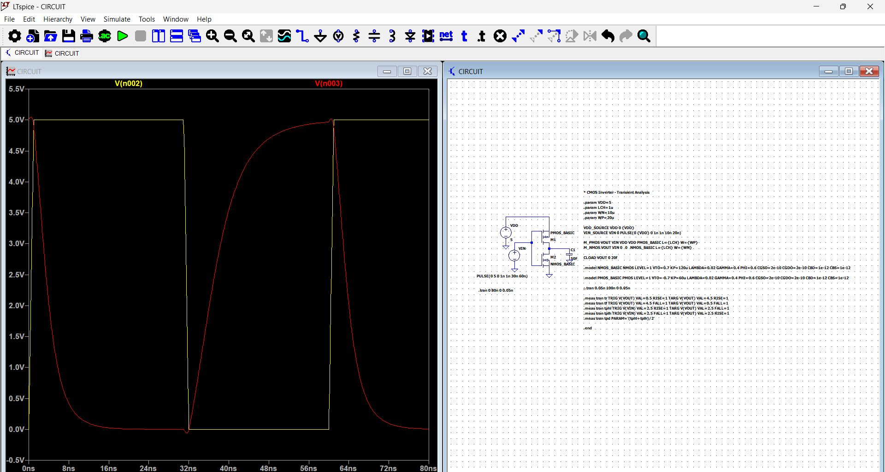

# CMOS Inverter Transient Analysis

## Objective

To design and simulate a CMOS inverter in LTspice and measure its transient switching characteristics, including rise time, fall time, and propagation delay.

## Circuit Description

The CMOS inverter consists of:

- One PMOS transistor connected between `VDD` and the output.
- One NMOS transistor connected between the output and ground.
- A pulse voltage source connected to both transistor gates.
- A `50 fF` load capacitor connected between the output and ground.

The inverter operation is:

- When `VIN = 0 V`, the PMOS is ON and the NMOS is OFF. Therefore, `VOUT` is high.
- When `VIN = 5 V`, the PMOS is OFF and the NMOS is ON. Therefore, `VOUT` is low.

The logic function is:

$$
V_{OUT}=\overline{V_{IN}}
$$

## Simulation Screenshot



_Figure 1: CMOS inverter transient analysis and output waveform._

## Simulation Parameters

| Parameter             |   Value |
| --------------------- | ------: |
| Supply voltage, `VDD` |     5 V |
| Input voltage range   |   0–5 V |
| NMOS width            |   10 µm |
| PMOS width            |   20 µm |
| Channel length        |    1 µm |
| Load capacitance      |   50 fF |
| Pulse rise time       |    1 ns |
| Pulse fall time       |    1 ns |
| Pulse width           |   30 ns |
| Pulse period          |   60 ns |
| Duty cycle            |     50% |
| Simulation duration   |   80 ns |
| Maximum time step     | 0.05 ns |

## Input Signal

The input voltage source was defined as:

```spice
PULSE(0 5 0 1n 1n 30n 60n)
```

The pulse parameters are:

| Parameter | Meaning         | Value |
| --------- | --------------- | ----: |
| `0`       | Initial voltage |   0 V |
| `5`       | Pulsed voltage  |   5 V |
| `0`       | Delay time      |  0 ns |
| `1n`      | Rise time       |  1 ns |
| `1n`      | Fall time       |  1 ns |
| `30n`     | Pulse width     | 30 ns |
| `60n`     | Pulse period    | 60 ns |

The duty cycle is:

$$
D=\frac{T_{ON}}{T_{period}}\times100
$$

$$
D=\frac{30\text{ ns}}{60\text{ ns}}\times100=50\%
$$

## Transient Analysis

The transient simulation command was:

```spice
.tran 0 80n 0 0.05n
```

The command parameters are:

| Parameter | Meaning                |   Value |
| --------- | ---------------------- | ------: |
| `0`       | Output time step       |       0 |
| `80n`     | Simulation stop time   |   80 ns |
| `0`       | Data-saving start time |    0 ns |
| `0.05n`   | Maximum time step      | 0.05 ns |

The circuit was simulated from 0 ns to 80 ns. Since the input period is 60 ns, the simulation includes one complete input cycle and part of the next cycle.

## Measurement Definitions

For a 0–5 V output signal:

$$
V_{10\%}=0.1V_{DD}=0.5\text{ V}
$$

$$
V_{50\%}=0.5V_{DD}=2.5\text{ V}
$$

$$
V_{90\%}=0.9V_{DD}=4.5\text{ V}
$$

The LTspice measurement commands were:

```spice
.meas tran tr TRIG V(VOUT) VAL=0.5 RISE=1 TARG V(VOUT) VAL=4.5 RISE=1

.meas tran tf TRIG V(VOUT) VAL=4.5 FALL=1 TARG V(VOUT) VAL=0.5 FALL=1

.meas tran tphl TRIG V(VIN) VAL=2.5 RISE=1 TARG V(VOUT) VAL=2.5 FALL=1

.meas tran tplh TRIG V(VIN) VAL=2.5 FALL=1 TARG V(VOUT) VAL=2.5 RISE=1

.meas tran tpd PARAM='(tphl+tplh)/2'
```

## Measurement Formulas

The output rise time is measured from 10% to 90% of `VDD`:

$$
t_r=t_{90\%}-t_{10\%}
$$

The output fall time is measured from 90% to 10% of `VDD`:

$$
t_f=t_{10\%}-t_{90\%}
$$

The high-to-low propagation delay is:

$$
t_{PHL}
=
t_{\text{output falling at }50\%}
-
t_{\text{input rising at }50\%}
$$

The low-to-high propagation delay is:

$$
t_{PLH}
=
t_{\text{output rising at }50\%}
-
t_{\text{input falling at }50\%}
$$

The average propagation delay is:

$$
t_{pd}=\frac{t_{PHL}+t_{PLH}}{2}
$$

## Simulation Results

| Parameter                 |      LTspice Result | Converted Result |
| ------------------------- | ------------------: | ---------------: |
| Rise time, `tr`           | 6.97979150211e-10 s |         0.698 ns |
| Fall time, `tf`           | 6.97283937220e-10 s |         0.697 ns |
| High-to-low delay, `tphl` | 4.63730437516e-10 s |         0.464 ns |
| Low-to-high delay, `tplh` | 4.63754630472e-10 s |         0.464 ns |
| Average delay, `tpd`      | 4.63742533994e-10 s |         0.464 ns |

The average propagation delay is:

$$
t_{pd}=\frac{t_{PHL}+t_{PLH}}{2}
$$

Substituting the measured values:

$$
t_{pd}
=
\frac{0.4637304375+0.4637546305}{2}\text{ ns}
$$

$$
t_{pd}=0.4637425340\text{ ns}
$$

Therefore:

$$
\boxed{t_{pd}\approx0.464\text{ ns}}
$$

## Observations

- The output waveform is the logical inverse of the input waveform.
- The input pulse has a period of 60 ns.
- The input remains high for 30 ns and low for 30 ns.
- The input duty cycle is 50%.
- The output rise time is approximately 0.698 ns.
- The output fall time is approximately 0.697 ns.
- The high-to-low and low-to-high propagation delays are nearly equal.
- The nearly equal rise and fall times indicate approximately balanced PMOS and NMOS switching strengths.
- The close values of `tphl` and `tplh` indicate balanced inverter delay characteristics.

## LTspice Warnings

LTspice reported warnings that the Level-1 MOSFET model uses transistor dimensions shorter or narrower than recommended.

These warnings are related to the simplified educational MOSFET model. The simulation completed successfully, and all requested measurements were obtained.

## Conclusion

The CMOS inverter was successfully designed and simulated using LTspice with a 5 V supply, a 50 fF load capacitor, and a 0–5 V pulse input.

The measured values were:

$$
t_r\approx0.698\text{ ns}
$$

$$
t_f\approx0.697\text{ ns}
$$

$$
t_{PHL}\approx0.464\text{ ns}
$$

$$
t_{PLH}\approx0.464\text{ ns}
$$

The average propagation delay was:

$$
\boxed{t_{pd}\approx0.464\text{ ns}}
$$

The results demonstrate the transient switching behavior and propagation delay of a CMOS inverter.
